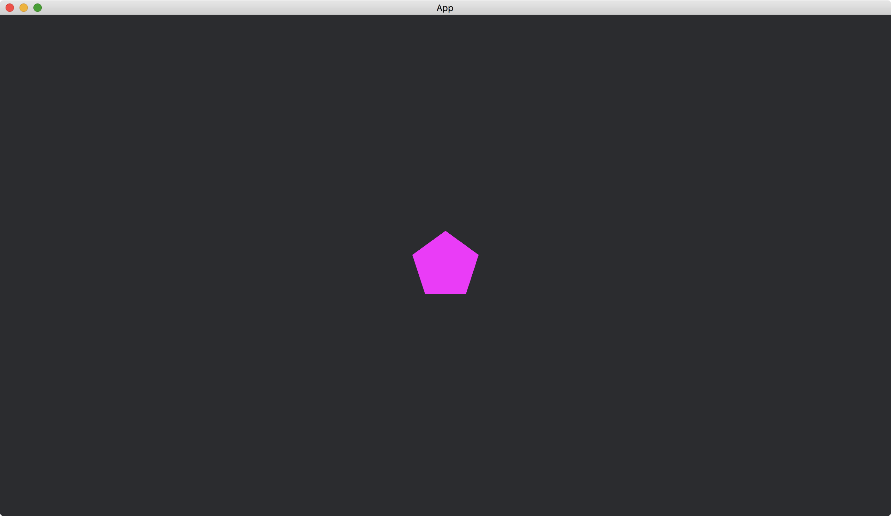

# A Timer Running Repeatedly

Previously, the [Timer](https://docs.rs/bevy/latest/bevy/time/struct.Timer.html) triggers an event once and then stops.
We can make a [Timer](https://docs.rs/bevy/latest/bevy/time/struct.Timer.html) repeating by [TimerMode::Repeating](https://docs.rs/bevy/latest/bevy/time/enum.TimerMode.html#variant.Repeating) so that it triggers events periodically.

```rust
Timer::from_seconds(0.5, TimerMode::Repeating)
```

In the following example, we rotate a [RegularPolygon](https://docs.rs/bevy/0.12.1/bevy/prelude/shape/struct.RegularPolygon.html) every 0.5 seconds.

```rust
fn polygon_rotates(
    time: Res<Time>,
    mut my_timer: ResMut<MyTimer>,
    mut polygons: Query<&mut Transform, With<Handle<ColorMaterial>>>,
) {
    let mut transform = polygons.single_mut();

    if my_timer.0.tick(time.delta()).just_finished() {
        *transform = Transform::from_rotation(Quat::from_rotation_z(time.elapsed_seconds() / 2.));
    }
}
```

The method [just_finished()](https://docs.rs/bevy/latest/bevy/time/struct.Timer.html#method.just_finished) of [Timer](https://docs.rs/bevy/latest/bevy/time/struct.Timer.html) here will be true every 0.5 seconds.
We use the method [elapsed_seconds()](https://docs.rs/bevy/latest/bevy/time/struct.Time.html#method.elapsed_seconds) of [Time](https://docs.rs/bevy/latest/bevy/time/struct.Time.html) to compute the degree of the rotation.

The full code is as follows:

```rust
use bevy::{
    app::{App, Startup, Update},
    asset::{Assets, Handle},
    core_pipeline::core_2d::Camera2dBundle,
    ecs::{
        query::With,
        system::{Commands, Query, Res, ResMut, Resource},
    },
    math::Quat,
    render::mesh::{shape::RegularPolygon, Mesh},
    sprite::{ColorMaterial, ColorMesh2dBundle},
    time::{Time, Timer, TimerMode},
    transform::components::Transform,
    utils::default,
    DefaultPlugins,
};

#[derive(Resource)]
struct MyTimer(Timer);

fn main() {
    App::new()
        .add_plugins(DefaultPlugins)
        .insert_resource(MyTimer(Timer::from_seconds(0.5, TimerMode::Repeating)))
        .add_systems(Startup, setup)
        .add_systems(Update, polygon_rotates)
        .run();
}

fn setup(mut commands: Commands, mut meshes: ResMut<Assets<Mesh>>) {
    commands.spawn(Camera2dBundle::default());

    commands.spawn(ColorMesh2dBundle {
        mesh: meshes.add(RegularPolygon::new(50., 5).into()).into(),
        ..default()
    });
}

fn polygon_rotates(
    time: Res<Time>,
    mut my_timer: ResMut<MyTimer>,
    mut polygons: Query<&mut Transform, With<Handle<ColorMaterial>>>,
) {
    let mut transform = polygons.single_mut();

    if my_timer.0.tick(time.delta()).just_finished() {
        *transform = Transform::from_rotation(Quat::from_rotation_z(time.elapsed_seconds() / 2.));
    }
}
```

When the app just started:



After 0.5 seconds:


After 1 second:


:arrow_right:  Next: [Triggering An Event](./triggering_an_event.md)

:blue_book: Back: [Table of contents](./../README.md)
