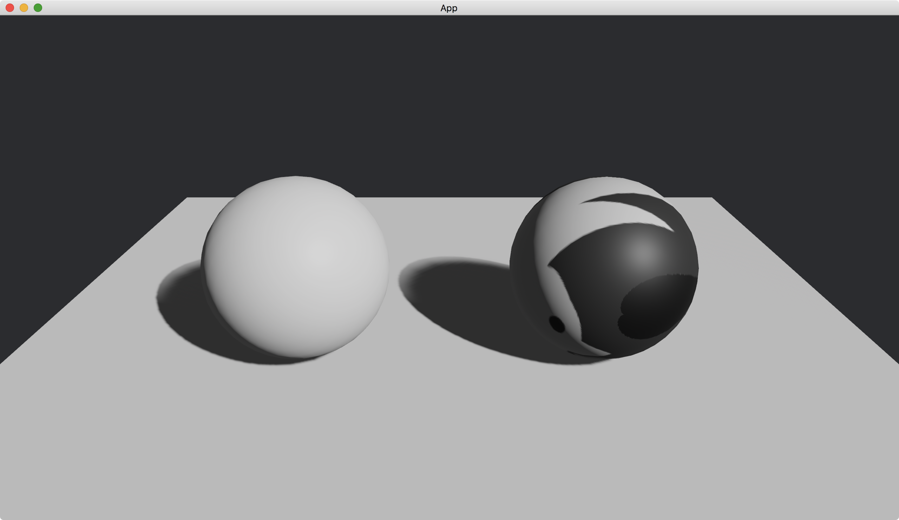

# Base Color Textures

Similar to 2D rendering, we can also paste textures to 3D objects.

Assume the `assets` directory has an image named [icon.png](https://github.com/bevyengine/bevy/blob/main/assets/branding/icon.png), which we will use as our texture.


We use [base_color_texture](https://docs.rs/bevy/latest/bevy/pbr/struct.StandardMaterial.html#structfield.base_color_texture) in [StandardMaterial](https://docs.rs/bevy/latest/bevy/pbr/struct.StandardMaterial.html) to paste the texture to a 3D object.

```rust
commands.spawn(PbrBundle {
    material: materials.add(StandardMaterial {
        base_color_texture: Some(asset_server.load("icon.png")),
        ..default()
    }),
    ..default()
});
```

The [base_color_texture](https://docs.rs/bevy/latest/bevy/pbr/struct.StandardMaterial.html#structfield.base_color_texture) needs `Option<Handle<Image>>`, in which [Handle](https://docs.rs/bevy/latest/bevy/asset/enum.Handle.html)<[Image](https://docs.rs/bevy/latest/bevy/render/texture/struct.Image.html)> can be [load](https://docs.rs/bevy/latest/bevy/asset/struct.AssetServer.html#method.load)ed by [AssetServer](https://docs.rs/bevy/latest/bevy/asset/struct.AssetServer.html).

In the example, we create two spheres.
The left sphere has no textures whereas the right one has the texture.

The full code is as follows:

```rust
use bevy::{
    app::{App, Startup},
    asset::{AssetServer, Assets},
    core_pipeline::core_3d::Camera3dBundle,
    ecs::system::{Commands, Res, ResMut},
    math::Vec3,
    pbr::{DirectionalLight, DirectionalLightBundle, PbrBundle, StandardMaterial},
    render::mesh::{
        shape::{Plane, UVSphere},
        Mesh,
    },
    transform::components::Transform,
    utils::default,
    DefaultPlugins,
};

fn main() {
    App::new()
        .add_plugins(DefaultPlugins)
        .add_systems(Startup, setup)
        .run();
}

fn setup(
    mut commands: Commands,
    mut meshes: ResMut<Assets<Mesh>>,
    mut materials: ResMut<Assets<StandardMaterial>>,
    asset_server: Res<AssetServer>,
) {
    commands.spawn(Camera3dBundle {
        transform: Transform::from_xyz(0., 2., 3.).looking_at(Vec3::new(0., 0.5, 0.), Vec3::Y),
        ..default()
    });

    // left
    commands.spawn(PbrBundle {
        mesh: meshes.add(
            UVSphere {
                radius: 0.5,
                ..default()
            }
            .into(),
        ),
        material: materials.add(StandardMaterial::default()),
        transform: Transform::from_xyz(-0.83, 0.5, 0.),
        ..default()
    });

    // right
    commands.spawn(PbrBundle {
        mesh: meshes.add(
            UVSphere {
                radius: 0.5,
                ..default()
            }
            .into(),
        ),
        material: materials.add(StandardMaterial {
            base_color_texture: Some(asset_server.load("icon.png")),
            ..default()
        }),
        transform: Transform::from_xyz(0.83, 0.5, 0.),
        ..default()
    });

    commands.spawn(PbrBundle {
        mesh: meshes.add(Plane::from_size(5.).into()),
        material: materials.add(StandardMaterial::default()),
        ..default()
    });

    commands.spawn(DirectionalLightBundle {
        directional_light: DirectionalLight {
            illuminance: 20000.,
            shadows_enabled: true,
            ..default()
        },
        transform: Transform::default().looking_to(Vec3::new(-1., -1., -1.), Vec3::Y),
        ..default()
    });
}
```

Result:



<!-- :arrow_right:  Next:  -->

:blue_book: Back: [Table of contents](./../README.md)
