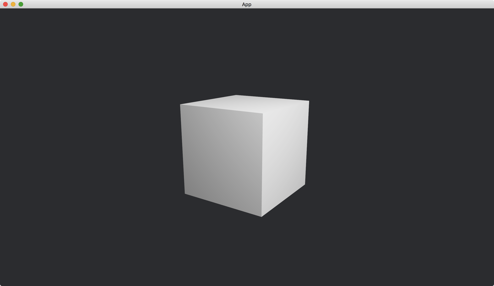

# Camera Positions And Directions

We can change camera positions and directions.

This is done by the [transform](https://docs.rs/bevy/latest/bevy/core_pipeline/core_3d/struct.Camera3dBundle.html#structfield.transform) in [Camera3dBundle](https://docs.rs/bevy/latest/bevy/core_pipeline/core_3d/struct.Camera3dBundle.html).

```rust
commands.spawn(Camera3dBundle {
    transform: Transform::from_xyz(2., 1., 3.).looking_at(Vec3::ZERO, Vec3::Y),
    ..default()
});
```

To change the camera position, we use the function [from_xyz](https://docs.rs/bevy/latest/bevy/transform/components/struct.Transform.html#method.from_xyz) of [Transform](https://docs.rs/bevy/latest/bevy/transform/components/struct.Transform.html).
This function sets the position of the camera.
In the example, we sets the position of our camera to `(2, 1, 3)`.
To change the camera direction, we use the method [looking_at](https://docs.rs/bevy/latest/bevy/transform/components/struct.Transform.html#method.looking_at) of [Transform](https://docs.rs/bevy/latest/bevy/transform/components/struct.Transform.html).
The method takes two parameters: *target* and *up*.
The camera will sit at the position specified by [from_xyz](https://docs.rs/bevy/latest/bevy/transform/components/struct.Transform.html#method.from_xyz) and look at the *target*, which is another position.
The parameter *up* is a direction pointing to the sky of the camera.
In the example, our camera looks at the origin, and the sky is on top of the camera.
Note that [Vec3::Y](https://docs.rs/bevy/latest/bevy/math/struct.Vec3.html#associatedconstant.Y) means the direction `(0, 1, 0)`.

The full code is as follows:

```rust
use bevy::{
    app::{App, Startup},
    asset::Assets,
    core_pipeline::core_3d::Camera3dBundle,
    ecs::system::{Commands, ResMut},
    math::Vec3,
    pbr::{PbrBundle, PointLightBundle, StandardMaterial},
    render::mesh::{shape::Cube, Mesh},
    transform::components::Transform,
    utils::default,
    DefaultPlugins,
};

fn main() {
    App::new()
        .add_plugins(DefaultPlugins)
        .add_systems(Startup, setup)
        .run();
}

fn setup(
    mut commands: Commands,
    mut meshes: ResMut<Assets<Mesh>>,
    mut materials: ResMut<Assets<StandardMaterial>>,
) {
    commands.spawn(Camera3dBundle {
        transform: Transform::from_xyz(2., 1., 3.).looking_at(Vec3::ZERO, Vec3::Y),
        ..default()
    });

    commands.spawn(PbrBundle {
        mesh: meshes.add(Cube::new(1.).into()).into(),
        material: materials.add(StandardMaterial::default()).into(),
        ..default()
    });

    commands.spawn(PointLightBundle {
        transform: Transform::from_xyz(2., 2., 1.),
        ..default()
    });
}
```

Currently, we omit the explanation of `PbrBundle` and `PointLightBundle`.
These bundles will be explained later.
Basically, we add a cube and a light to the scene.
The cube is centered at the origin.

Result:



<!-- :arrow_right:  Next:  -->

:blue_book: Back: [Table of contents](./../README.md)
