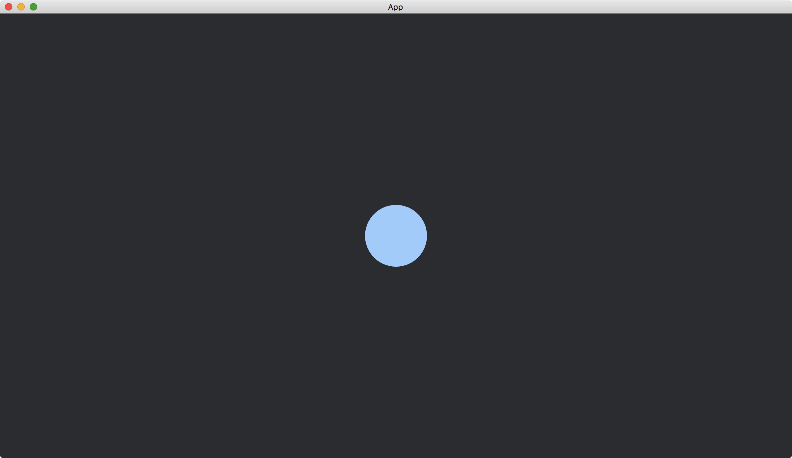

# Keyboard Just Input

The method [pressed](https://docs.rs/bevy/0.12.1/bevy/input/struct.Input.html#method.pressed) returns true whenever the corresponding key is pressed.
If we want to catch the moment when the key is just pressed, we have to use the method [just_pressed](https://docs.rs/bevy/0.12.1/bevy/input/struct.Input.html#method.just_pressed).

In the following example, the color of the circle is changed when the key `space` is pressed.

We declare two colors and store them in the resource `MyColors`.

```rust
#[derive(Resource, Default)]
struct MyColors {
    color1: Handle<ColorMaterial>,
    color2: Handle<ColorMaterial>,
}
```

We create a resource named `MyCircleHighlighted` and use its field `0` to indicate which color we are using.

```rust
#[derive(Resource, Default)]
struct MyCircleHighlighted(bool);
```

The two colors are initialized in the system `setup` and the dark one is bound to the circle.

```rust
fn setup(
    mut commands: Commands,
    mut meshes: ResMut<Assets<Mesh>>,
    mut materials: ResMut<Assets<ColorMaterial>>,
    mut my_colors: ResMut<MyColors>,
) {
    commands.spawn(Camera2dBundle::default());

    my_colors.color1 = materials.add(Color::hsl(210., 1., 0.4).into());
    my_colors.color2 = materials.add(Color::hsl(210., 1., 0.8).into());

    commands.spawn(ColorMesh2dBundle {
        mesh: meshes.add(Circle::new(50.).into()).into(),
        material: my_colors.color1.clone(),
        ..default()
    });
}
```

The color of the circle is changed when the key is *just* pressed.

```rust
fn handle_keys(
    keyboard_input: Res<Input<KeyCode>>,
    mut my_circle_highlighted: ResMut<MyCircleHighlighted>,
    mut circles: Query<&mut Handle<ColorMaterial>>,
    my_colors: ResMut<MyColors>,
) {
    let mut handle = circles.single_mut();

    if keyboard_input.just_pressed(KeyCode::Space) {
        my_circle_highlighted.0 = !my_circle_highlighted.0;
        if my_circle_highlighted.0 {
            *handle = my_colors.color2.clone();
        } else {
            *handle = my_colors.color1.clone();
        }
    }
}
```

The full code is as follows:

```rust
use bevy::{
    app::{App, Startup, Update},
    asset::{Assets, Handle},
    core_pipeline::core_2d::Camera2dBundle,
    ecs::system::{Commands, Query, Res, ResMut, Resource},
    input::{keyboard::KeyCode, Input},
    render::{
        color::Color,
        mesh::{shape::Circle, Mesh},
    },
    sprite::{ColorMaterial, ColorMesh2dBundle},
    utils::default,
    DefaultPlugins,
};

#[derive(Resource, Default)]
struct MyCircleHighlighted(bool);

#[derive(Resource, Default)]
struct MyColors {
    color1: Handle<ColorMaterial>,
    color2: Handle<ColorMaterial>,
}

fn main() {
    App::new()
        .add_plugins(DefaultPlugins)
        .init_resource::<MyCircleHighlighted>()
        .init_resource::<MyColors>()
        .add_systems(Startup, setup)
        .add_systems(Update, handle_keys)
        .run();
}

fn setup(
    mut commands: Commands,
    mut meshes: ResMut<Assets<Mesh>>,
    mut materials: ResMut<Assets<ColorMaterial>>,
    mut my_colors: ResMut<MyColors>,
) {
    commands.spawn(Camera2dBundle::default());

    my_colors.color1 = materials.add(Color::hsl(210., 1., 0.4).into());
    my_colors.color2 = materials.add(Color::hsl(210., 1., 0.8).into());

    commands.spawn(ColorMesh2dBundle {
        mesh: meshes.add(Circle::new(50.).into()).into(),
        material: my_colors.color1.clone(),
        ..default()
    });
}

fn handle_keys(
    keyboard_input: Res<Input<KeyCode>>,
    mut my_circle_highlighted: ResMut<MyCircleHighlighted>,
    mut circles: Query<&mut Handle<ColorMaterial>>,
    my_colors: ResMut<MyColors>,
) {
    let mut handle = circles.single_mut();

    if keyboard_input.just_pressed(KeyCode::Space) {
        my_circle_highlighted.0 = !my_circle_highlighted.0;
        if my_circle_highlighted.0 {
            *handle = my_colors.color2.clone();
        } else {
            *handle = my_colors.color1.clone();
        }
    }
}
```

When the app just starts:


When the key `space` just pressed at the first time:



The color change happens at the moment when the key is just pressed, and will not take effect when we continue to hold the key `space` down.

If we want to monitor the moment when a key is just released, we can use the method [just_released](https://docs.rs/bevy/0.12.1/bevy/input/struct.Input.html#method.just_released).
The usage is the same as [just_pressed](https://docs.rs/bevy/0.12.1/bevy/input/struct.Input.html#method.just_pressed).

:arrow_right:  Next: [Keyboard Events](./keyboard_events.md)

:blue_book: Back: [Table of contents](./../README.md)
