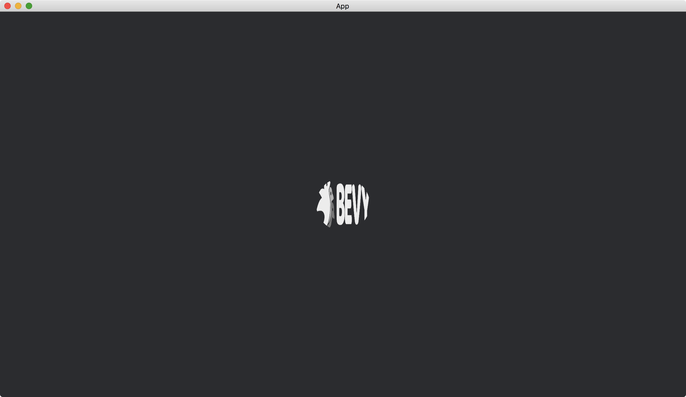

# Textures

We can not only change colors of added shapes, but also add textures to the shapes.
In other words, we can paste an image onto a shape.

We assume we have an image named [bevy_logo_dark.png](https://github.com/bevyengine/bevy/blob/main/assets/branding/bevy_logo_dark.png) in the `assets` directory. The image looks like this:


We use a method that is similar to how we display images.

```rust
fn setup(
    mut commands: Commands,
    mut meshes: ResMut<Assets<Mesh>>,
    mut materials: ResMut<Assets<ColorMaterial>>,
    asset_server: Res<AssetServer>,
) {
    commands.spawn(Camera2dBundle::default());

    commands.spawn(ColorMesh2dBundle {
        mesh: meshes.add(Circle::new(50.).into()).into(),
        material: materials.add(asset_server.load("bevy_logo_dark.png").into()),
        ..default()
    });
}
```

We use resource [AssetServer](https://docs.rs/bevy/latest/bevy/asset/struct.AssetServer.html) to load the image.
The image is added to [Assets](https://docs.rs/bevy/latest/bevy/asset/struct.Assets.html)<[ColorMaterial](https://docs.rs/bevy/latest/bevy/sprite/struct.ColorMaterial.html)>, and then its [Handle](https://docs.rs/bevy/latest/bevy/asset/enum.Handle.html) is assigned to [material](https://docs.rs/bevy/latest/bevy/sprite/type.ColorMesh2dBundle.html#structfield.material) of [ColorMesh2dBundle](https://docs.rs/bevy/latest/bevy/sprite/type.ColorMesh2dBundle.html).

The full code is as follows:

```rust
use bevy::{
    app::{App, Startup},
    asset::{AssetServer, Assets},
    core_pipeline::core_2d::Camera2dBundle,
    ecs::system::{Commands, Res, ResMut},
    prelude::default,
    render::mesh::{shape::Circle, Mesh},
    sprite::{ColorMaterial, ColorMesh2dBundle},
    DefaultPlugins,
};

fn main() {
    App::new()
        .add_plugins(DefaultPlugins)
        .add_systems(Startup, setup)
        .run();
}

fn setup(
    mut commands: Commands,
    mut meshes: ResMut<Assets<Mesh>>,
    mut materials: ResMut<Assets<ColorMaterial>>,
    asset_server: Res<AssetServer>,
) {
    commands.spawn(Camera2dBundle::default());

    commands.spawn(ColorMesh2dBundle {
        mesh: meshes.add(Circle::new(50.).into()).into(),
        material: materials.add(asset_server.load("bevy_logo_dark.png").into()),
        ..default()
    });
}
```

Result:



We can see that the image is mapped automatically onto the shape.

<!-- :arrow_right:  Next:  -->

:blue_book: Back: [Table of contents](./../README.md)
