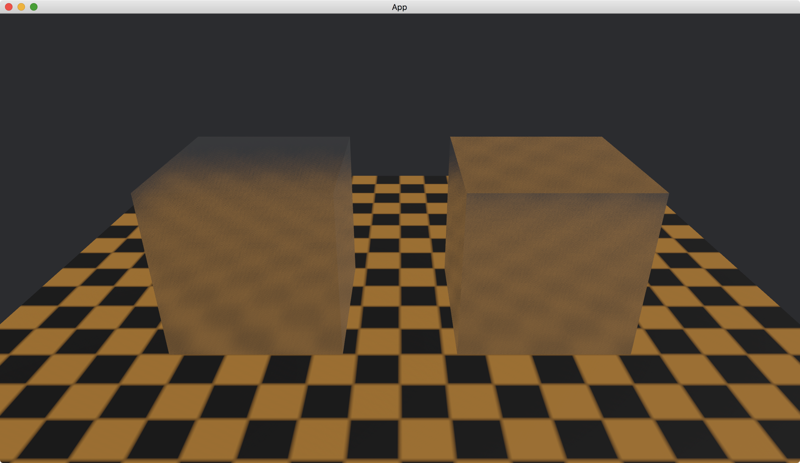

# Thickness

When an object is transparent, we can make it looks like a thick lens.

To do this, we use [thickness](https://docs.rs/bevy/latest/bevy/pbr/struct.StandardMaterial.html#structfield.thickness) in [StandardMaterial](https://docs.rs/bevy/latest/bevy/pbr/struct.StandardMaterial.html).

```rust
commands.spawn(PbrBundle {
    material: materials.add(StandardMaterial {
        thickness: 1.,
        ..default()
    }),
    ..default()
});
```

The value of [thickness](https://docs.rs/bevy/latest/bevy/pbr/struct.StandardMaterial.html#structfield.thickness) is either `0` or not `0`.
To turn on this feature, we give it a non-zero value.

In the following example, we create two cubes.
The left cube has [thickness](https://docs.rs/bevy/latest/bevy/pbr/struct.StandardMaterial.html#structfield.thickness) `0` and the right one has `1`.
To make the difference obvious, we set all [specular_transmission](https://docs.rs/bevy/latest/bevy/pbr/struct.StandardMaterial.html#structfield.specular_transmission) to 1.
We also create an orange plane with a texture [board.png](./pic/board.png) and disable all shadows.

The full code is as follows:

```rust
use bevy::{
    app::{App, Startup},
    asset::{AssetServer, Assets},
    core_pipeline::core_3d::Camera3dBundle,
    ecs::system::{Commands, Res, ResMut},
    math::Vec3,
    pbr::{DirectionalLight, DirectionalLightBundle, PbrBundle, StandardMaterial},
    render::{
        color::Color,
        mesh::{
            shape::{Cube, Plane},
            Mesh,
        },
    },
    transform::components::Transform,
    utils::default,
    DefaultPlugins,
};

fn main() {
    App::new()
        .add_plugins(DefaultPlugins)
        .add_systems(Startup, setup)
        .run();
}

fn setup(
    mut commands: Commands,
    mut meshes: ResMut<Assets<Mesh>>,
    mut materials: ResMut<Assets<StandardMaterial>>,
    asset_server: Res<AssetServer>,
) {
    commands.spawn(Camera3dBundle {
        transform: Transform::from_xyz(0., 2., 3.).looking_at(Vec3::new(0., 0.5, 0.), Vec3::Y),
        ..default()
    });

    // left
    commands.spawn(PbrBundle {
        mesh: meshes.add(Cube::new(1.).into()),
        material: materials.add(StandardMaterial {
            specular_transmission: 1.,
            thickness: 0.,
            ..default()
        }),
        transform: Transform::from_xyz(-0.83, 0.5, 0.),
        ..default()
    });

    // right
    commands.spawn(PbrBundle {
        mesh: meshes.add(Cube::new(1.).into()),
        material: materials.add(StandardMaterial {
            specular_transmission: 1.,
            thickness: 1.,
            ..default()
        }),
        transform: Transform::from_xyz(0.83, 0.5, 0.),
        ..default()
    });

    commands.spawn(PbrBundle {
        mesh: meshes.add(Plane::from_size(5.).into()),
        material: materials.add(StandardMaterial {
            base_color: Color::ORANGE,
            base_color_texture: Some(asset_server.load("board.png")),
            ..default()
        }),
        ..default()
    });

    commands.spawn(DirectionalLightBundle {
        directional_light: DirectionalLight {
            illuminance: 50000.,
            ..default()
        },
        transform: Transform::default().looking_to(Vec3::new(-1., -1., -1.), Vec3::Y),
        ..default()
    });
}
```

Result:



<!-- :arrow_right:  Next:  -->

:blue_book: Back: [Table of contents](./../README.md)
